# Actividad unidad 5 - Automatización del ciclo de vida de una Aplicación

**Alumno:** Ivan Muriel  
**Módulo:** Puesta en Producción Segura (PPS)  

A continuación se detalla el proceso seguido para la automatización del ciclo de vida de la aplicación *Store App*, abarcando desde la compilación local hasta el despliegue automatizado mediante integración continua (CI/CD) con Jenkins y Docker.

---

## 1. Ciclo de vida en equipo local (manual)

El primer paso consistió en verificar que el código fuente de la aplicación compila y se empaqueta correctamente en nuestro entorno local (Kali Linux) utilizando las herramientas de construcción de Maven y Java 11.

### 1.1 Compilación y tests

Se ejecutaron los comandos del ciclo de vida de Maven para validar y compilar el código fuente.

* **Fase de compilación:** Se ejecutó `mvn compile`, obteniendo un *BUILD SUCCESS*.
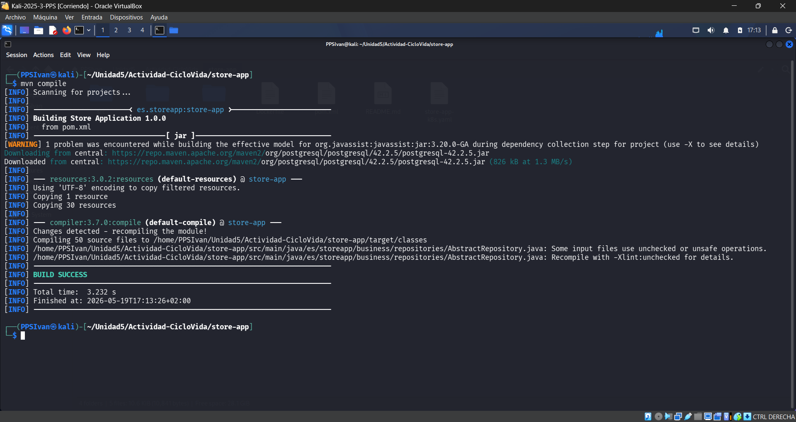

* **Fase de pruebas:** Se comprobó que el código pasa correctamente la fase de pruebas ejecutando `mvn test`.
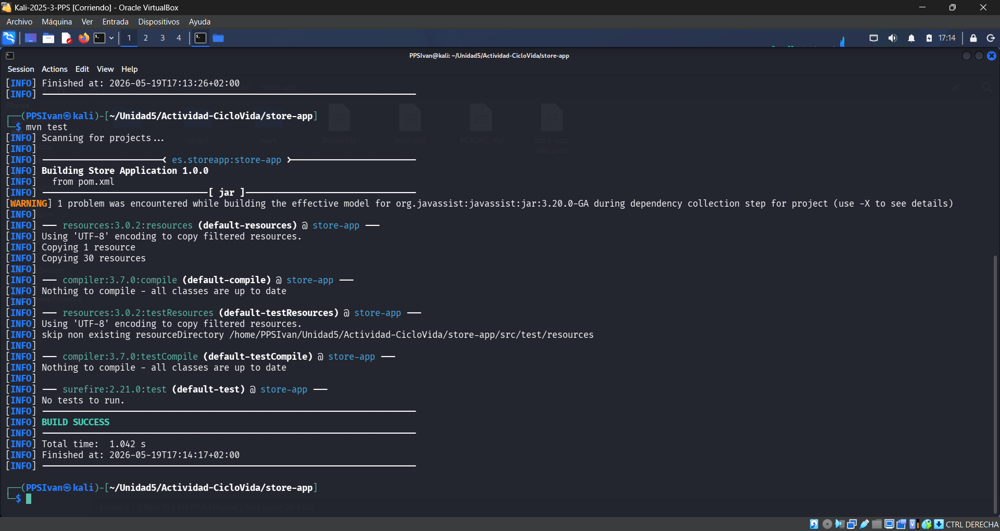

### 1.2 Empaquetado

A continuación, se procedió a empaquetar la aplicación generando el artefacto final (`.jar`) mediante el comando `mvn package`.
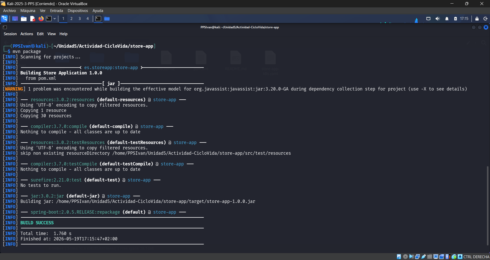

### 1.3 Construcción de la imagen Docker

Para la fase de despliegue local, fue necesario construir la imagen de Docker utilizando el `Dockerfile` proporcionado.

Durante el primer intento, se detectó un error debido a que el `Dockerfile` estaba configurado para buscar el artefacto en la ruta de GitHub Actions (`artifact/*.jar`) en lugar de la ruta local de Maven (`target/*.jar`).
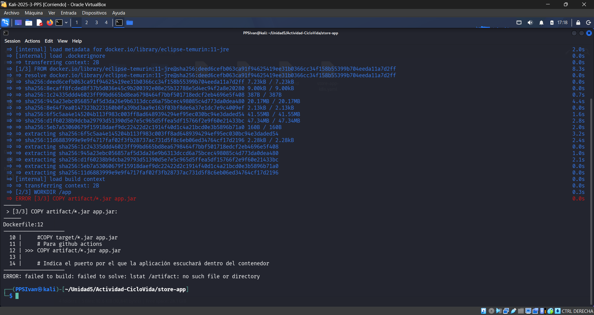

Se procedió a corregir el `Dockerfile` mediante el editor Nano, comentando la línea de GitHub Actions y descomentando la ruta correcta para entornos locales y Jenkins.
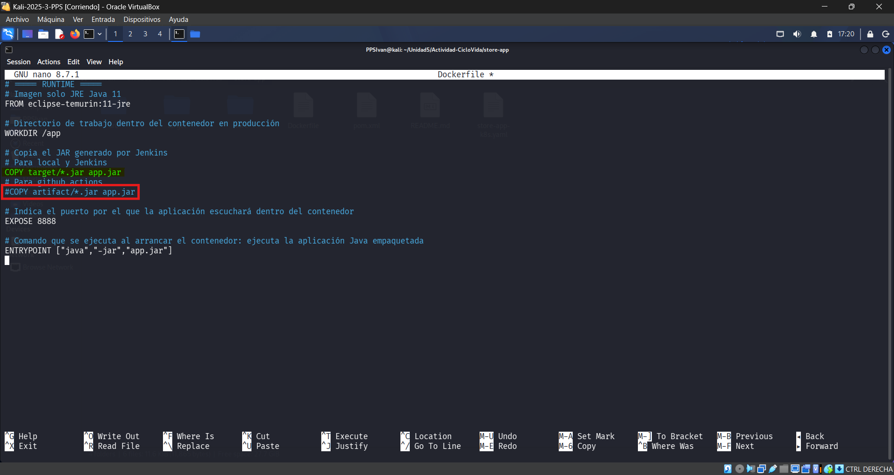

Una vez corregido, la imagen `store-app` se construyó de manera exitosa en el sistema.
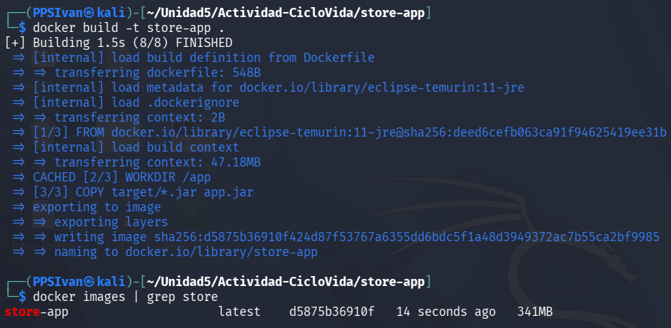

### 1.4 Despliegue local y verificación

Finalmente, se levantó el escenario multicontenedor (Aplicación + Base de Datos PostgreSQL) utilizando `docker compose up`. Se verificó el correcto funcionamiento accediendo a la aplicación web a través de `http://localhost:8888`.
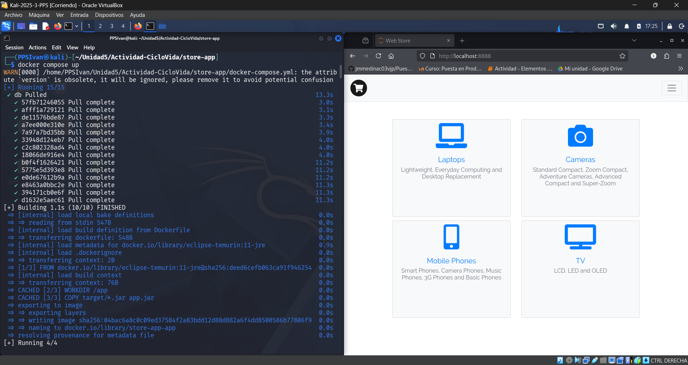

---

## 2. Automatización con Jenkins (CI/CD)

Una vez comprobado el funcionamiento en local, el objetivo pasó a automatizar todo el proceso mediante un servidor Jenkins, definiendo las etapas a través de un *Pipeline script*.

### 2.1 Configuración inicial del pipeline

Se configuró una nueva tarea en Jenkins especificando el repositorio de GitHub y las credenciales necesarias para clonar el proyecto.
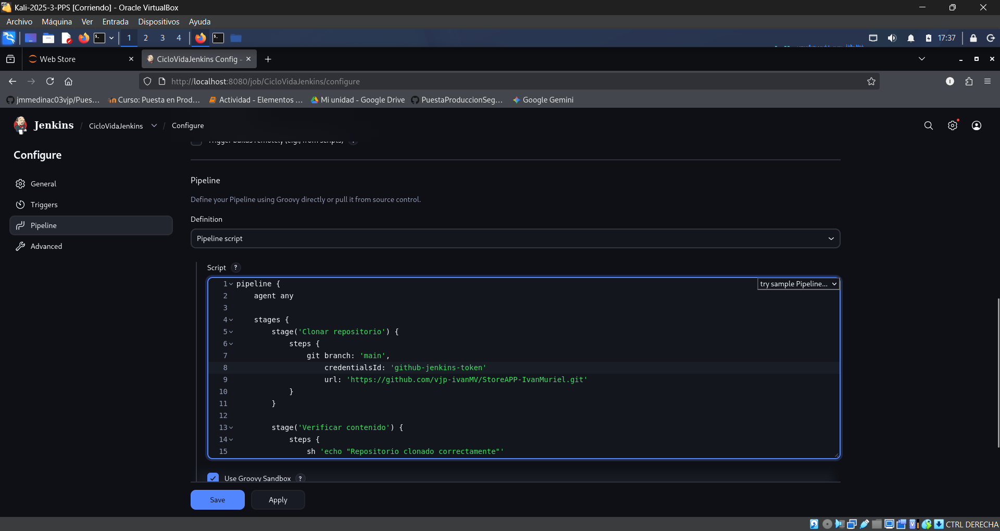

Tras la primera ejecución básica, comprobamos que Jenkins clonó el repositorio correctamente. El *Workspace* reflejaba la estructura de archivos exacta del proyecto, incluyendo el `pom.xml`, el `Dockerfile` y los manifiestos.
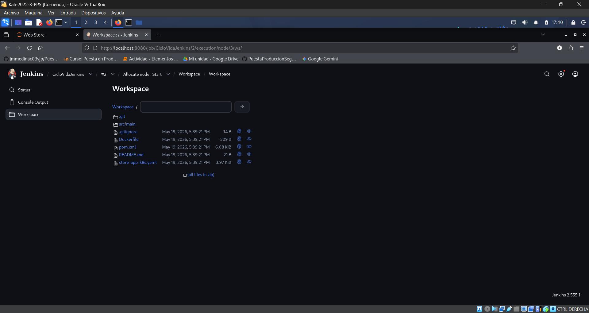

La ejecución inicial completó de manera exitosa las etapas de "Clonar repositorio" y "Verificar contenido".
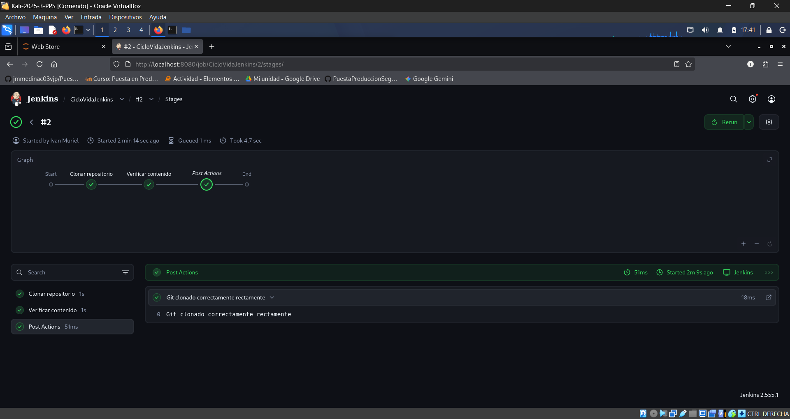

### 2.2 Integración de Maven en Jenkins

Se añadieron progresivamente las etapas del ciclo de vida de Maven al Pipeline, inyectando temporalmente las variables de entorno para usar Java 11.

* **Etapa de tests:** Jenkins ejecutó las pruebas automatizadas con éxito.
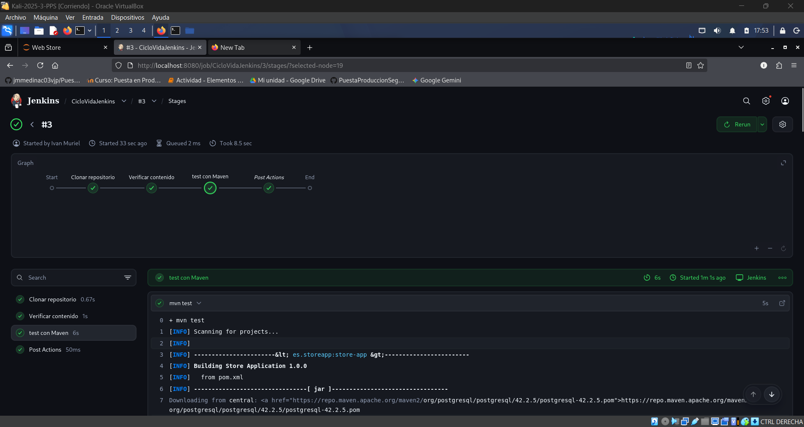

* **Etapa de empaquetado:** Se introdujo la instrucción `mvn clean package`. La compilación fue exitosa, validando que el servidor CI puede construir la aplicación.
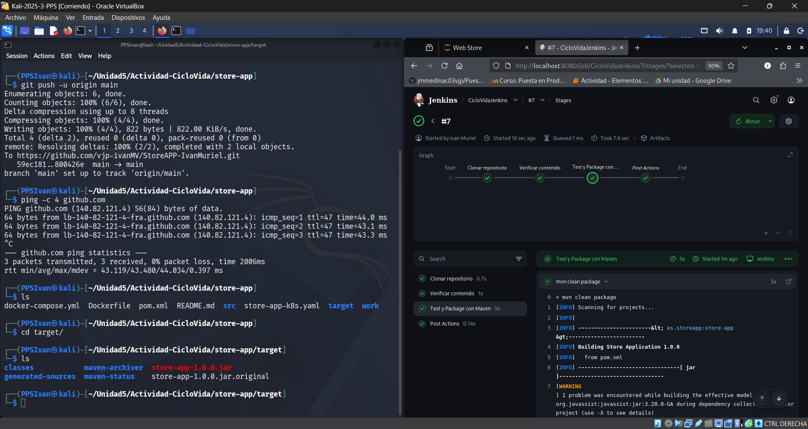

Se verificó en el *Workspace* de Jenkins y en la salida estándar que el archivo `store-app-1.0.0.jar` se generó correctamente dentro de la carpeta `target/` del entorno automatizado.
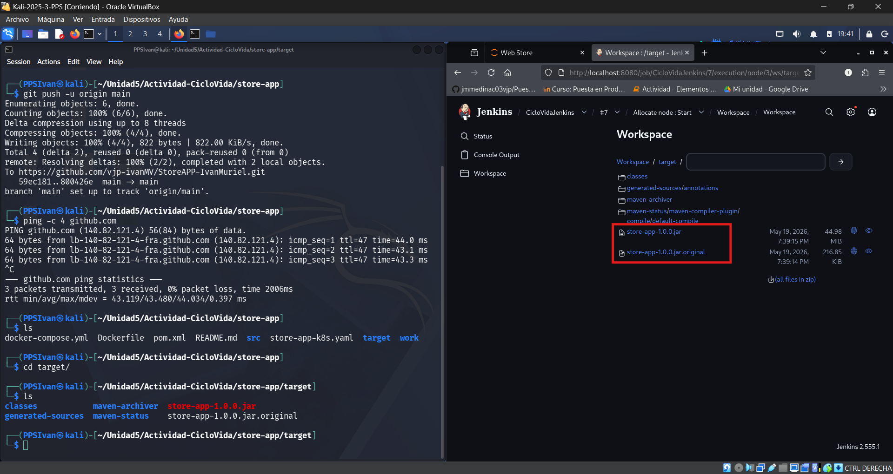

### 2.3 Despliegue automatizado con Docker Compose

En esta iteración del pipeline, se integró la construcción de la imagen Docker y el despliegue del entorno multicontenedor directamente desde Jenkins. Tras resolver conflictos de puertos ocupados en el entorno, el pipeline completo finalizó en verde, cubriendo exitosamente hasta el levantamiento del escenario con `docker compose`.
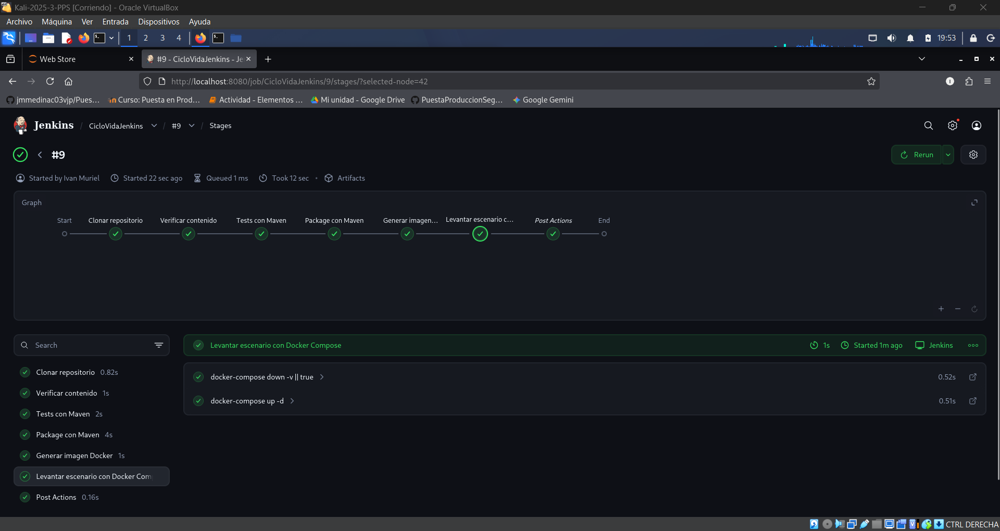

### 2.4 Securización y despliegue en Kubernetes (pipeline final)

El paso final consistió en un pipeline más avanzado que sustituyó el despliegue de Docker Compose por un despliegue en un clúster de Kubernetes (Minikube), integrando además herramientas de seguridad.

Durante la ejecución, la herramienta Trivy analizó la imagen construida en busca de vulnerabilidades, reportando los resultados (CVEs detectados) directamente en los registros de Jenkins para asegurar la integridad del contenedor antes de su despliegue.
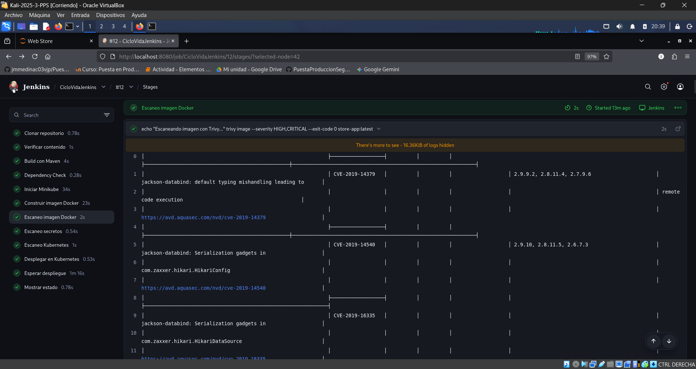

Posteriormente, se aplicaron los manifiestos de Kubernetes (`store-app-k8s.yaml`) automatizando la creación de los recursos necesarios: secretos, ConfigMap, volumen persistente (PVC), servicios y *deployments*. Tras ampliar el tiempo de espera (*timeout*) para permitir la correcta descarga de imágenes en el entorno virtual, el despliegue se completó satisfactoriamente.

Finalmente, la etapa de "Mostrar estado" confirmó que los *pods* de la aplicación y la base de datos estaban corriendo (*Running*), proporcionando la URL final generada por Minikube para acceder al servicio desplegado.
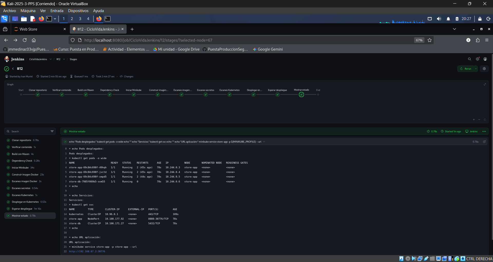
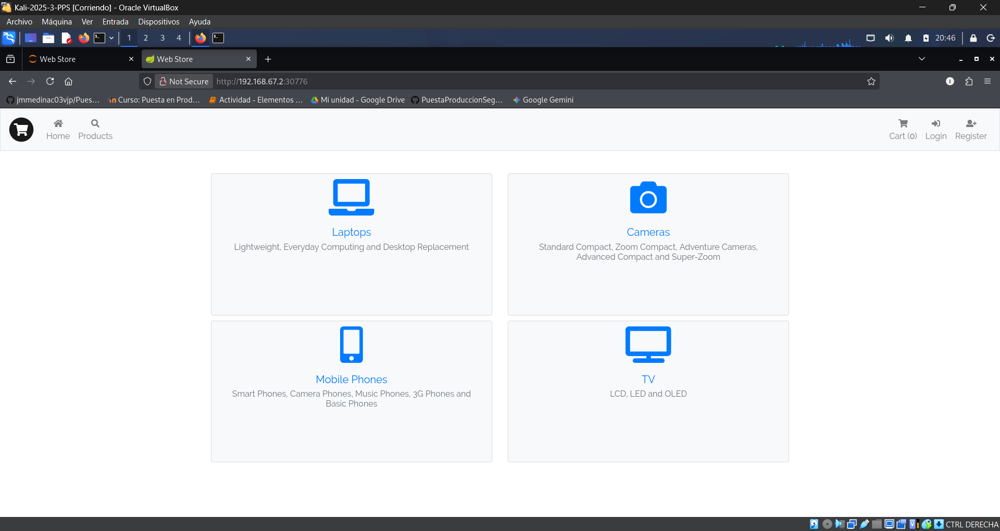
